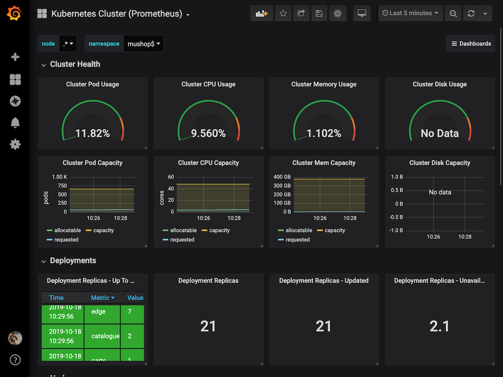

# Play with Grafana

## Get Grafana Admin Password

`kubectl get secret -n mushop-utilities mushop-utils-grafana -o jsonpath="{.data.admin-password}" | base64 --decode ; echo`{{execute}}

## Open the deployed Grafana Dashboards here

[Open Grafana](https://[[HOST_SUBDOMAIN]]-80-[[KATACODA_HOST]].environments.katacoda.com/grafana) (Ingress Port 80)

Or copy and paste this link on your browser: `https://[[HOST_SUBDOMAIN]]-80-[[KATACODA_HOST]].environments.katacoda.com/grafana`

That options will direct you to the Grafana Dashboards.

